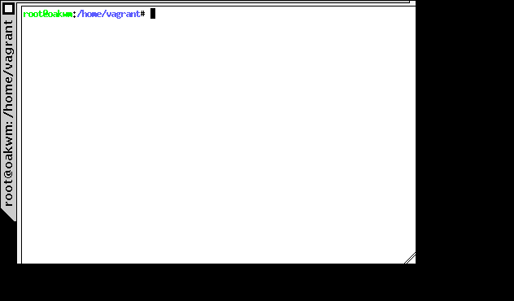

# oakwm -- a window manager

oakwm is a window manager for X. It provides an unusual style of window
decoration and as little functionality as we feel comfortable with in a
modern window manager. Unlike *wm2*, it is configurable, there is no
reason for most people to edit the source and recompile the code.

oakwm is designed for devices that may switch between a mouse and
keyboard input to a touchscreen input. These low-powered devices are
typically lacking in processing power and RAM, hence the want for a
lightweight window manager. oakwm is aiming to be a no-thrills
lightweight experience.

oakwm provides:

* Decorative frames for your windows.
* The ability to move, resize, hide and restore windows.
* No icons.
* No configurable root menus, buttons or mouse or keyboard bindings.
* No virtual desktop, toolbars or integrated applications.

## Building oakwm

**TODO:** Update this section.

You will need a Unix machine, X libraries and a C++ compiler such as
gcc.  You will also need a mouse, with at least one button.  Your X
server and libraries must be R4 or newer and must support the Shape
extension.  wm2 does NOT support multi-screen displays, because I
don't have anything to test multi-screen code on.

wm2 makes relatively heavy demands on the performance of your X
server, because of the use of shaped windows, but it shouldn't place
too much of a load on other aspects of your system.

Inspect the file Config.h.  If any of the settings (fonts, colours and
"xterm" application name) in this file are unlikely to work with your
system, change them.  Ensure that CONFIG_NASTY_FONT is set to
something which is unlikely not to be found.

Edit the Makefile to suit the requirements of your system, and run
"make depend" followed by "make".  This should build wm2.  On certain
systems you may need to edit the source to overcome problems with the
location of non-POSIX functions such as putenv() and select().

## Using oakwm

**TODO:** Update this section.

To run wm2, make sure you're not already running a window manager,
make sure the DISPLAY variable is correctly set, and then execute the
file "wm2".  There are no command-line options or X resources, and
there is no start-up file.  If your X server doesn't support the Shape
extension, wm2 will exit (and will never work on your server); if it
can't find the required fonts or allocate the required colours, it
will also exit (but you should be able to fix this by changing the
definitions in Config.h and recompiling).

Available window manipulations are:

* To focus a window: depends on the focus policy you selected
in Config.h before compiling.  See "Focus policy", below.
* To raise a window: click on its tab or frame, unless you have
auto-raise on focus set in Config.h.
* To move a window: make sure it's in focus, then click and drag
on its tab.
* To hide a window: make sure it's in focus, then click on the
button at the top of its tab.
* To recover a hidden window: click left button on the root
window for the root menu, and choose the window you want.
* To start a new xterm: use the first item on root menu ("New").
* To delete a window: make sure it's in focus, click on the
button on the tab, hold the mouse button for at least a
second and a half until the cursor changes to a cross, then
release.  (I know, it's not very easy.  On the other hand,
things like Windows-95 tend to obscure the fact that most
windows already have a perfectly good Close option.  If the
default delay doesn't suit you, change it in Config.h and
recompile.)
* To resize a window: make sure it's in focus, then click and
drag on its bottom-right corner.  For a constrained resize,
click and drag on the bottom-left or top-right corner of
the enclosing window frame.
* To flip around amongst the windows on-screen: click with the right
mouse button on the root window or on any window's frame or tab.
* To exit from wm2: move the mouse pointer to the very edge of the
screen at the extreme lower-right corner, and click left button on
the root window for the root menu.  The menu should have an extra
option labelled "Exit wm2"; select this.

All move and resize operations are opaque.

## Testing

Testing is performed with `oakwm` running in within Vagrant. The vagrant file
has a low-ish execution cap and 128MB of RAM to better simulate low-powered
devices. (You may need to adjust this to suite your particular testing needs.)

You will need:

* `vagrant` - A script for managing the virtual machine.
* `virtualbox` - The virtual machine for running the window manager.

To start the environment, simply type:

    vagrant up --provision

(It's not needed to have `--provision` on the first run, but it's good practice
to ensure your VM is up-to-date.)

Next you can either SSH into the environment (`vagrant ssh`) or use the
VirtualBox manager to open the GUI (recommended for testing the UI).

Login for vagrant is `vagrant` (username and password). Once in:

    cd; sudo startx

## Focus policy

**TODO:** Update this section.

Config.h contains settings for focus policy.  There are three things
you can define to either True or False: CONFIG_CLICK_TO_FOCUS,
CONFIG_RAISE_ON_FOCUS and CONFIG_AUTO_RAISE.  The first two are
connected: together they define a focus policy.  The third is a
separate focus policy on its own and will only work if the first two
are both False.  CONFIG_AUTO_RAISE differs from
(!CONFIG_CLICK_TO_FOCUS && CONFIG_RAISE_ON_FOCUS) only in that it
provides a short delay before raising each window.  The delay is also
definable in Config.h.

## Pixmaps

**TODO:** Update this section.

This fourth release of wm2 no longer supports frame background
pixmaps.  If you want them, consider using wmx (available from the
same place as wm2) instead.

## xterm

**TODO:** Update this section.

Some versions of xterm and rxvt run badly with wm2.  If you use xterm
and find that it refreshes the window excessively slowly, you might
like to try experimenting with a different terminal emulation program.
I think it might help to ensure that the scrollbar is on the
right-hand side of the rxvt window and is thick enough that wmx's
resize handle doesn't obscure any of the text area.

## Credits

### wm2

wm2 was written by Chris Cannam, recycling a lot of code and structure
from "9wm" by David Hogan (see http://www.cs.su.oz.au/~dhog/ ). 9wm
is written in C, so very little of the code is used verbatim, but the
intention was to reuse and a lot of the resulting code is
recognisable. (Also 9wm's minimalism was rather inspiring.) I've
made enough changes to make it very probable that any bugs you find
will be my fault rather than David's.

wm2 also uses version 2.0 of Alan Richardson's "xvertext"
font-rotation routines.

The sideways tabs on the window frames were Andy Green's idea.

### oakwm

oakwm is based on wm2, rewritten by B[] in 2020. The idea is to keep
the minimalism embedded into wm2, whilst modernizing it and addressing
new computer interface inputs, such as touchscreens.

### General

If you want to hack the code into something else for your own
amusement, please go ahead. Feel free to modify and redistribute, as
long as you retain the original copyrights as appropriate.

## Bugs

**TODO:** Write this section.
