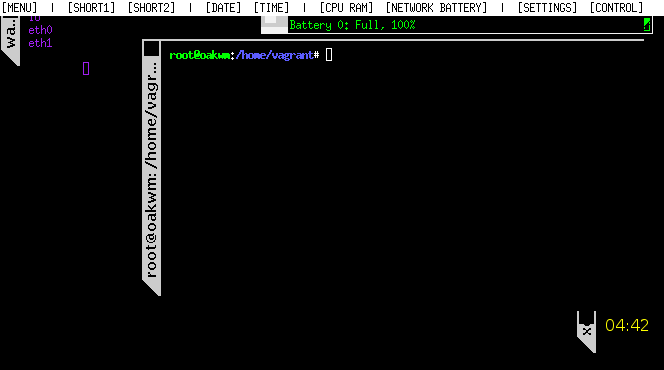

# oakwm -- a window manager

oakwm is a window manager for X. It provides an unusual style of window
decoration and as little functionality as we feel comfortable with in a
modern window manager. Unlike *wm2*, it is configurable, there is no
reason for most people to edit the source and recompile the code.

oakwm is designed for devices that may switch between a mouse and
keyboard input to a touchscreen input. These low-powered devices are
typically lacking in processing power and RAM, hence the want for a
lightweight window manager. oakwm is aiming to be a no-thrills
lightweight experience.

oakwm provides:

* Decorative frames for your windows
* The ability to move, resize, hide and restore windows
* Basic icons
* No buttons or mouse or keyboard bindings
* No virtual desktop or integrated applications (only a lightweight toolbar)

**See the [roadmap](roadmap.md) for more information.**

## Building oakwm

You will need a Unix machine, X libraries and a C++ compiler such as
gcc. You will also need a mouse, with at least one button. Your X
server and libraries must be R4 or newer and must support the Shape
extension. oakwm does NOT support multi-screen displays, because it's currently
outside the scope of the project.

See the *testing* section for recommended information on building.

The JSON configuration file is the main method for making changes to the
interface, please read the documentation *before* making changes as you may
cause the X server to crash otherwise.

## Using oakwm

**TODO:** Update this section.

## Testing

Testing is performed with `oakwm` running in within Vagrant. The vagrant file
has a low-ish execution cap and 128MB of RAM to better simulate low-powered
devices. (You may need to adjust this to suite your particular testing needs.)

You will need:

* `vagrant` - A script for managing the virtual machine.
* `virtualbox` - The virtual machine for running the window manager.

To start the environment, simply type:

    vagrant up --provision

(It's not needed to have `--provision` on the first run, but it's good practice
to ensure your VM is up-to-date.)

Next you can either SSH into the environment (`vagrant ssh`) or use the
VirtualBox manager to open the GUI (recommended for testing the UI).

Login for vagrant is `vagrant` (username and password). Once in:

    cd; sudo startx

## Credits

### wm2

wm2 was written by Chris Cannam, recycling a lot of code and structure
from "9wm" by David Hogan (see http://www.cs.su.oz.au/~dhog/ ). 9wm
is written in C, so very little of the code is used verbatim, but the
intention was to reuse and a lot of the resulting code is
recognisable. (Also 9wm's minimalism was rather inspiring.) I've
made enough changes to make it very probable that any bugs you find
will be my fault rather than David's.

wm2 also uses version 2.0 of Alan Richardson's "xvertext"
font-rotation routines.

The sideways tabs on the window frames were Andy Green's idea.

### oakwm

oakwm is based on wm2, rewritten by B[] in 2020. The idea is to keep
the minimalism embedded into wm2, whilst modernizing it and addressing
new computer interface inputs, such as touchscreens.

### General

If you want to hack the code into something else for your own
amusement, please go ahead. Feel free to modify and redistribute, as
long as you retain the original copyrights as appropriate.

## Bugs

When running oakwm and coming across bugs, please attach your relevant logfile
(usually `.txt`). It provides useful information such as the build date,
branch, commit hash and various debugging messages.

Bugs can be submitted using GitHub's "issues" feature.
